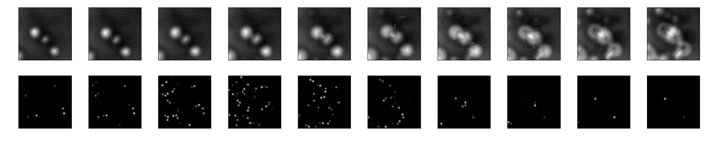
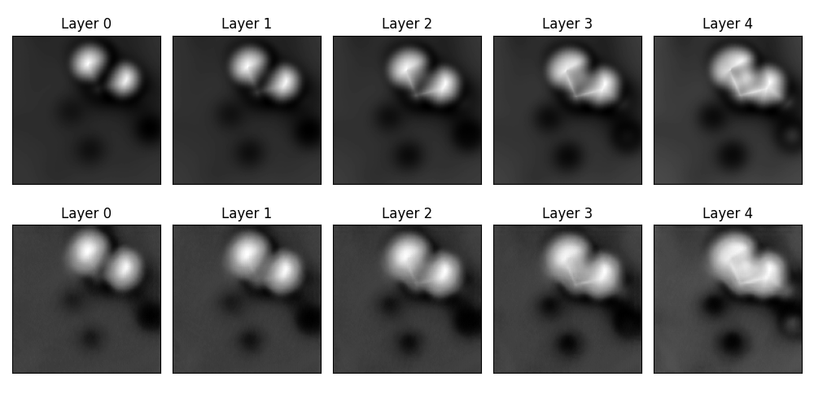

# AFM-Augmentation
Enhancing AFM Image Analysis and Prediction through Machine Learning and Data Augmentation

This project relies on the [ASD-AFM-dev](https://github.com/SINGROUP/ASD-AFM-dev) data-augmentation branch as well as [CycleGAN](https://github.com/junyanz/pytorch-CycleGAN-and-pix2pix) to realise the style translation. 

## Usage

### 0. Preparations
Clone this project:

```bash
git clone --recurse-submodules git@github.com:SINGROUP/StyleTransAugment.git
```

Create and activate a conda environment:
```bash
# Conda environment installation
cd ASD-AFM-dev/
conda env create -f environment.yml
conda activate ml
git checkout data-augmentation
```

Change to a GPU node (My case)
```bash
srun -p gpushort --gres=gpu:4 --constraint=pascal  --time=4:00:00 --mem=6000M --pty bash
```

Compile extensions by running 
```
cp /etc/OpenCL/vendors/nvidia.icd $CONDA_PREFIX'/etc/OpenCL/vendors/'
./build.sh
```

### 1. Dataload demostration
```
python 1_dataload.py 
```
Several input-label pairs that look like the following would be stored in the folder `temp`. 


### 2. Style translation 
```
python 2_augment.py 
```
Several images named  with `Debug_xxxxx.png` would appear in the folder `temp`, which look like this:



where first row of images are original PPAFM images at different heights, while the second row are the corresponding style-transfored images. 

### 3. Train with simplified posnet with style-translated image
```
python 3_fit_simplified_posnet.py
```
