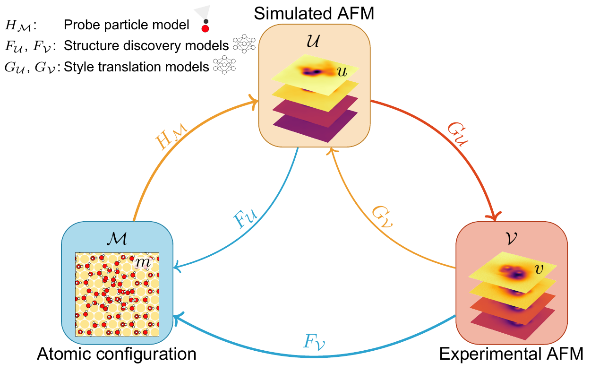

# Improving atomic force microscopy structure discovery via style-translation
<p align='center'>

</p>

## Abstract

Atomic force microscopy (AFM) is a key tool for characterising nanoscale structures, with functionalised tips now offering detailed images of the atomic structure. In parallel, AFM simulations using the particle probe model provide a cost-effective approach for rapid AFM image generation. Using state-of-the-art machine learning models and substantial simulated datasets, properties such as molecular structure, electrostatic potential, and molecular graph can be predicted from AFM images. However, transferring model performance from simulated to experimental AFM images poses challenges due to the subtle variations in real experimental data compared to the seemingly flawless simulations. In this study, we explore style translation to augment simulated images and improve the predictive performance of machine learning models in surface property analysis. We reduce the style gap between simulated and experimental AFM images and demonstrate the method's effectiveness in enhancing structure discovery models through local structural property distribution comparisons. This research presents a novel approach to improving the efficiency of machine learning models in the absence of labelled experimental data.


## Overview
There are several folders in the project. 
- `src`: source code for this study, which includes (1) `preEvaluation`: Data-driven approach to evaluate the performance of style translation; (2) `performanceEvaluation`: Performance evaluations of the structure models on the experimental AFM images based on the local structural properties; and (3) `StyleTrans` (submodule): Using CycleGAN framework for training the style translation model to obtain the style translation models. In (1) and (2), the included `snakemake` file is used to show the logic and run the code.
- `data`: input data files used in the project
- `processed_data`: intermediate files from the analysis. These files can be  generated by the code in `src`.
- `results`: results of the analysis, which are used for the figures in the manuscript.
- `manuscript`: figures used in the manuscript.

## Installation
We use `conda` to manage all the packages. You can create and activate it by using:
```bash
conda env create -f myenv.yml
conda activate sta
```

## Run the code
1. Make sure to enter the `sta` conda environment as shown in Installation. 
2. Change to the corresponding folder and check the `Snakefile`:
   
```bash
cd src/performanceEvaluation/
```
For each Python, there's a rule to run it in `Snakefile`:
```
...
# Show training sample
rule visualiseTrainingData:
    input:
        script = "visualiseTrainingData.py",
        data_dir = "../../data/structures/simulations/Label"
    output:
        out_dir = directory("../../results/train_data")
    shell:
        """
        python ./visualiseTrainingData.py
    """
...
```
3. Run it using `'snakemake --cores 1 visualiseTrainingData`.

If you have any questions about the code, feel free to [open an issue](https://github.com/SINGROUP/StyleTransAugment/issues/new).


## Data
The training data for the style translation, machine expert, and structure discovery models
are publicly available at [Zenodo: https://doi.org/10.5281/zenodo.16828078](https://doi.org/10.5281/zenodo.16828078).

## Citation
Cited as:

> Jie Huang, Niko Oinonen, Fabio Priante, Filippo Federici Canova, Lauri Kurki, Chen Xu, and Adam
S. Foster, Improving atomic force microscopy structure discovery via style-translation, [arXiv:2509.02240](https://arxiv.org/abs/2509.02240), 2025

Or

```
@misc{sin2025sta,
      title={Improving atomic force microscopy structure discovery via style-translation}, 
      author={Jie Huang and Niko Oinonen and Fabio Priante and Filippo Federici Canova and Lauri Kurki and Chen Xu and Adam S. Foster},
      year={2025},
      eprint={2509.02240},
      archivePrefix={arXiv},
      primaryClass={cond-mat.mtrl-sci},
      url={https://arxiv.org/abs/2509.02240}, 
}
```
